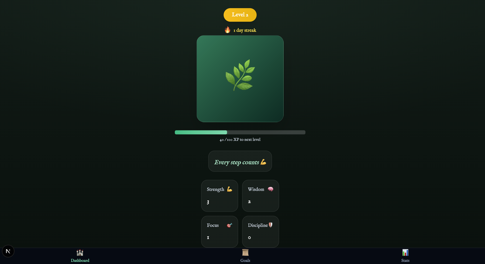
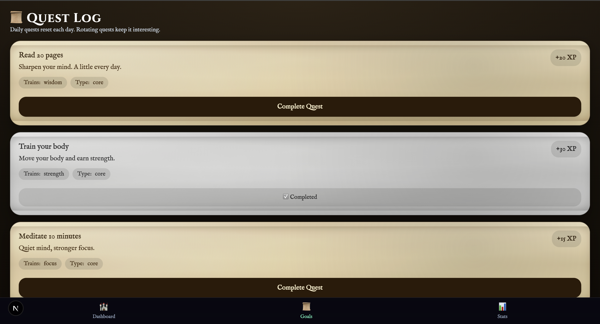
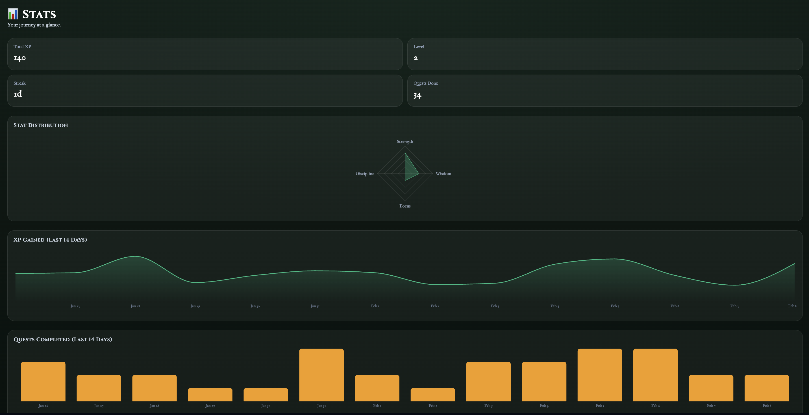

# Life XP

A gamified habit tracker that turns your daily goals into RPG quests. Complete quests, earn XP, level up, and grow your plant.

## Screenshots

<p align="center">
  
  
  
</p>

## Features

- **Quest System** — Daily core quests and rotating quests that refresh each day
- **XP & Leveling** — Earn XP for completing quests, level up every 100 XP
- **Player Stats** — Track Strength, Wisdom, Focus, and Discipline as you complete different quest types
- **Streak Tracking** — Maintain daily streaks with visual intensity scaling
- **Plant Growth** — Watch your plant evolve from a seedling to a tree as you progress
- **Lore Unlocks** — Discover narrative story moments at milestone levels
- **Level-Up Celebrations** — Animated celebration with sparkle effects on level up
- **Stats Dashboard** — Radar chart for stat distribution, XP over time, and quest completion history
- **Installable PWA** — Install on your phone as a standalone app with offline support
- **Smooth Animations** — Page transitions, staggered entrances, spring-animated XP bar, and quest completion effects

## Tech Stack

- **Framework:** Next.js 16 with TypeScript
- **UI:** Tailwind CSS v4, Radix UI, shadcn/ui
- **Animations:** Framer Motion
- **Charts:** Recharts
- **PWA:** @ducanh2912/next-pwa with Workbox
- **Fonts:** Cinzel + IM Fell English (RPG/medieval aesthetic)
- **State:** React Context API with localStorage persistence

## Getting Started

```bash
npm install
npm run dev
```

Open [http://localhost:3000](http://localhost:3000) in your browser.

## Project Structure

```
pages/
  index.tsx          Dashboard — level, plant, XP bar, stats, streak
  dailyGoals.tsx     Quest log with daily/rotating quests
  stats.tsx          Charts and historical data
components/
  Plant.tsx          Animated plant that grows with XP
  XPBar.tsx          Spring-animated progress bar
  XPFloat.tsx        Floating "+XP" animation
  StreakFire.tsx      Streak counter with fire animation
  SkillPreview.tsx   2x2 stat grid
  LoreModal.tsx      Story unlock modal
  LevelUpModal.tsx   Level-up celebration with particles
  BottomNav.tsx      Tab navigation
context/
  ProgressContext.tsx Global state — XP, level, streak, history
lib/
  types.ts           TypeScript types
  progress.ts        XP, leveling, and streak logic
  quests.ts          Quest definitions
  storage.ts         localStorage wrapper
```

## Build

```bash
npm run build
npm run lint
```
